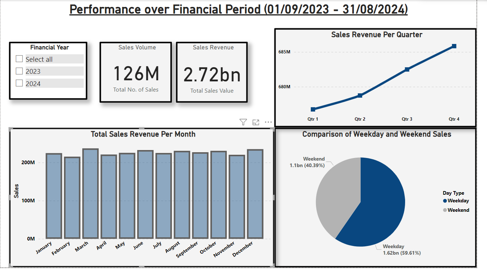
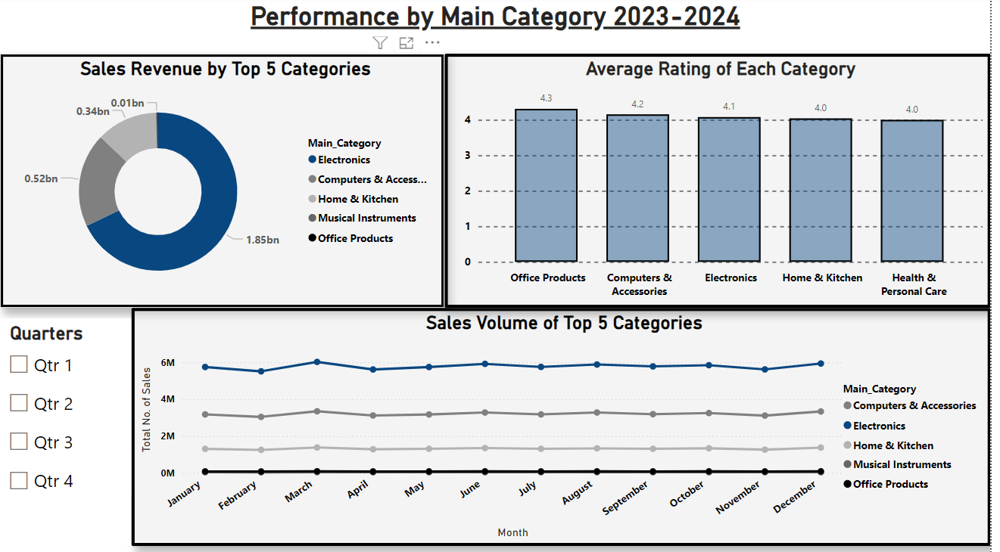
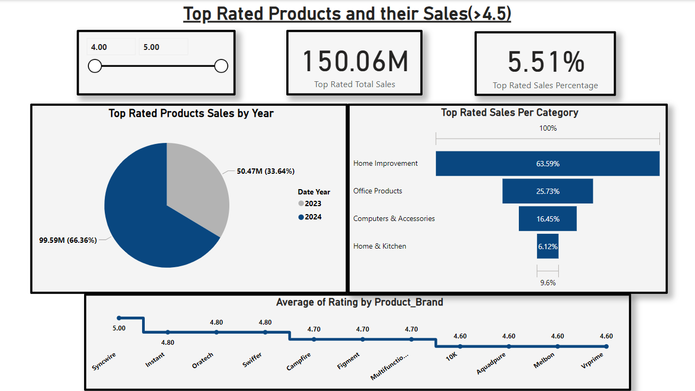

# Amazon-Sales-Performance-Dashboard
A comprehensive analysis of Amazon sales performance and product ratings with financial period breakdowns, category hierarchy navigation, and weekday/weekend sales comparisons. 

This Power BI dashboard provides comprehensive analysis of Amazon sales performance and product ratings with financial period breakdowns, category hierarchy navigation, and weekday/weekend sales comparisons.

## Key Features  
- 🗂️ **Category Hierarchy Navigation**: Cleaned and transformed category descriptions  
- 📅 **Financial Period Analysis**: Sales by FY (Apr-Mar), Quarter, and Month  
- 📊 **Weekday vs Weekend Performance**: Comparative sales metrics  
- 🏆 **Top Rated Products**: Highlight products with ratings ≥4.5 and their sales contribution  
- 🔍 **Drill-Through Capability**: Access granular data from any visual  
- 🎚️ **Dynamic Filters**: Date range, category, rating, and weekday/weekend toggles  

## Dashboard Preview  
  

## Data Transformation Steps  
1. **Category Cleaning**:  
   - Replaced "&" with " & " for readability  
   - Added spaces between words in joined categories  
   - Split multi-level categories into hierarchies  

2. **Financial Periods**:  
   - Created `Financial Year` column (April 1 - March 31)  
   - Generated `Financial Quarter` (Apr-Jun, Jul-Sep, etc.)  
   - Added `Financial Month` names  

3. **Date Intelligence**:  
   - Created `Day Type` (Weekday/Weekend) column  
   - Added `Day of Week` names  

4. **Product Rating Flags**:  
   - Identified top-rated products (rating ≥4.5 + rating_count > 100)  
   - Calculated sales contribution percentage  

## Key Metrics & Visuals  
| Section | Key Visuals |  
|---------|-------------|  

| **Category Analysis** |  |  
| **Product Ratings** |  |  

## Report Structure  
1. **Sales Performance Dashboard**  
   - Rolling 12-month sales trend  
   - Financial period breakdown  
   - Weekday vs weekend comparison  

2. **Product Analysis**  
   - Top rated products by category  
   - Rating distribution vs sales volume  

3. **Category Drill-down**  
   - Hierarchical category navigation  
   - Subcategory performance comparison  

4. **Detailed Data View**  
   - Drill-through to raw data tables  
   - Export-ready data tables  

## Dataset  
- `amazon_products.csv`: Product metadata  
- `amazon_sales.csv`: Daily sales records  
